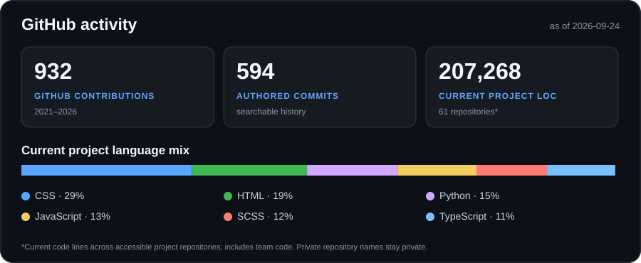

# Furkan Esen

Co-founder of [Avexra Digital](https://github.com/Avexra-Digital). I build web products and the technical systems behind discovery, conversion, and delivery. My work spans product engineering, technical SEO, and growth infrastructure.

[Website](https://www.furkanesen.com.tr/) · [LinkedIn](https://www.linkedin.com/in/esenfurkan/) · [X](https://x.com/byfurkanesen)

## The work in numbers

**702,095 lines of code written** is my own lifetime count, including projects that have never been uploaded to GitHub. It is a self-reported figure, not a GitHub statistic or a count inferred from my current repositories. The [source note](personal-metrics.json) records its scope and date.

The GitHub figures cover **2021–2026**: about **1,000 contributions** across the yearly calendars (**936** in the 24 September 2026 snapshot) and **598 searchable authored commits**. Separately, I scanned **89 accessible, non-fork repositories containing code**: they held **250,877 current code lines** at that point. That last number includes teammates' code and is a project-size measure. It is **not** the basis for the 702,095 personal tally. The [aggregate snapshot](stats.json) and [counting method](scripts/update_stats.py) are available here; private repository names and code are not published.

## Languages

**Programming:** Python · JavaScript · TypeScript · Go · Lua (including MTA:SA Lua) · SQL

**Web and styling:** HTML · CSS · SCSS

The language mix in the chart is calculated from **current code in accessible repositories**, including organization work. It is not a breakdown of my 702,095 lifetime lines.

## Technologies and tools

| Area | Technologies and tools |
| --- | --- |
| Front end | React.js, Vue.js, Next.js, Tailwind CSS, Bootstrap 5+, shadcn/ui, Radix UI, Sass, Framer Motion, Three.js, Tiptap |
| Back end | Python, Django, Django REST Framework, Django Channels, FastAPI, Go, JavaScript, Node.js, Express.js, Celery, SQLAlchemy, MTA:SA Lua |
| Databases | MongoDB, PostgreSQL, Firebase, MySQL, SQLite, Apache Cassandra, Redis, Supabase, Neon |
| Database tools and ORMs | phpMyAdmin, Navicat, Prisma, Drizzle ORM |
| Data and AI | NumPy and pandas (intermediate); currently learning PyTorch |
| Editors and IDEs | WebStorm, IntelliJ IDEA, Visual Studio Code, Visual Studio |
| Version control and delivery | Git, GitHub, Docker, Vercel, Vite, Parcel |
| Cloud and servers | AWS and Azure (basic to intermediate); VDS and VPS administration |
| Operating systems | Linux, Windows 7/8/10/11, Pardus |
| Testing and integrations | Playwright, Vitest, React Testing Library, ESLint, Clerk, NextAuth, Discord.js, Telegraf, Twilio, Resend |

This inventory combines technologies I have used directly with those found in accessible project manifests. Experience levels are specified where relevant; PyTorch is a current learning focus. The [inventory script](scripts/inventory_tech.py) prints aggregate package names without revealing private project names.

## Selected work

- **[MasalApp · Avexra Digital](https://www.furkanesen.com.tr/en/work/masalapp):** SEO and website performance work with a public case note and explicit measurement limits.
- **[jusTHINK · Co-founder & CTO](https://www.furkanesen.com.tr/en/work/justhink):** Product engineering and team development. Explore the public [justhink-latest repository](https://github.com/Justhink-Community/justhink-latest).
- **[Focusify · Back-end development](https://github.com/focusifynet):** Django and Go product work in 2023–2024. The private code is not presented as public portfolio evidence.

I care about the path from a working product to a measurable outcome, and about stating clearly which part of that path the evidence actually supports.
